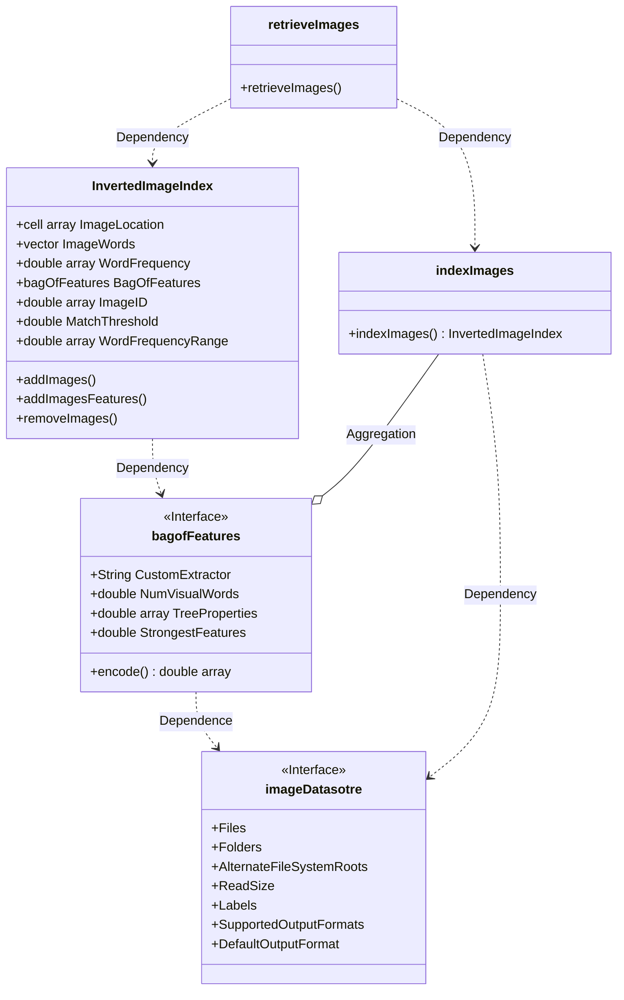
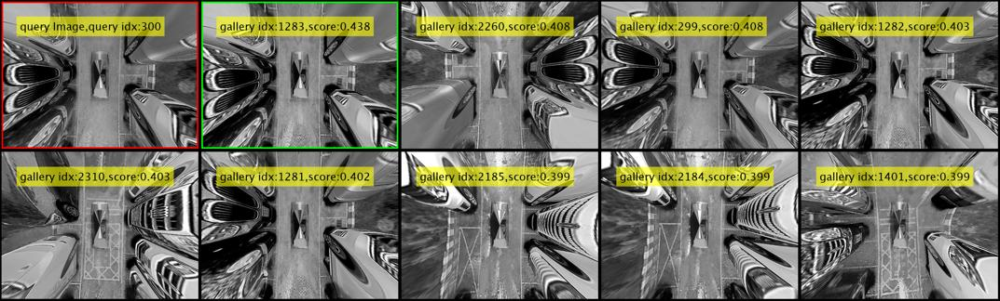

# MATLAB版本DBOW3回环检测库(图像相似度检测)

## Overview

本库由于MATLAB计算机视觉工具箱(Computer Vision Toolbox™)中内置系列对象函数[`invertedImageIndex`](https://www.mathworks.com/help/vision/ref/invertedimageindex.html)对于SLAM回环检索（图像相似度）能力相对较弱，故本库利用DBOW3算法优势，**支持MATLAB中`mex`文件自动构建，C/C++代码生成直接映射到此库源代码，支持返回图片的相似度top-k排序，使用方便。**

## 说明

本库额外增加了`mex/`、`c_file/`文件目录，分别用于`mex`构建和C/C++代码生成的入口函数。还增加了Dockfile文件构建镜像，方便部署自动构建。

## Requirements

- MATLAB®
- OpenCV(C++)
- C++ Compiler (e.g., GCC, Clang, or MSVC)

## How to use

```bash
git clone https://github.com/cuixing158/DBOW3.git
cd DBOW3
mkdir build  
cd build
cmake ..
make
```

然后你可以在`./build/mex/`文件夹下得到适用于你平台的mex文件，可在MATLAB中直接当作“内置函数”使用。使用简要语法为：

```matlab
% matlab中对应的语法为：
loopDatabase(imageFileList,"init"); % 对imageFileList文本文件中每行图像文件进行特征提取和用于创建词袋，仅执行一次即可
loopDatabase(dbFile,"load"); % 对dbFile文件加载为database，仅执行一次即可
loopDatabase(image,"add"); % 用于循环中，不断添加图像image的特征
result = loopDatabase(image,"query"); % 用于循环中，用于适当时候做检索任务,result为10*2大小矩阵，每行形如[queryID,score]。
loopDatabase("aaa","unclock");% 可取消mexUnlock占用，删除mex文件
```

具体可以参阅[`loopDatabase.cpp`](./mex/loopDatabase.cpp)接口文件。

## invertedImageIndex类图

在MATLAB中内置`invertedImageIndex`类型用于将视觉单词映射到图像的搜索索引，下面的类图较为清晰的展开了相关函数属性关系。



## DBOW3

DBOW3方法在loopclosure detection中某个数据集的表现，采用top9可视化：<br>



## References

[MATLAB MEX file For C/C++ code generation](https://github.com/cuixing158/mex-file)<br>
[基于CMake交叉编译C++得到适用与Matlab的Mex加速库文件](https://github.com/cuixing158/MexCmake)<br>
[DBOW3](https://github.com/rmsalinas/DBow3)<br>
